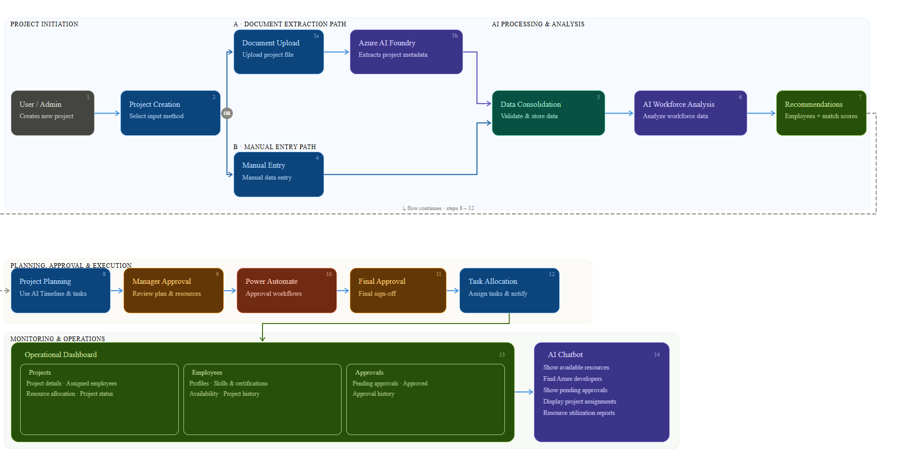

# AllocationIQ

> AI-Powered Project Allocation & Resource Management for Microsoft 365

---

## Overview

**AllocationIQ** is a SharePoint Framework (SPFx) solution that brings AI-assisted project intake, intelligent resource allocation, and manager approval workflows into your Microsoft 365 environment. Built on the Heft build system with React and PnPjs, it integrates Azure AI Foundry agents to automate the heavy lifting of team composition and project planning.

---

## Features

| Feature | Description |
|---|---|
| **AI Project Intake** | Upload SOWs or project briefs — fields are auto-extracted via AI agents |
| **Smart Staff Allocation** | Team recommendations based on skills, availability, and fit |
| **Automated Project Plans** | Timeline and task breakdowns generated by PlanningAgent |
| **Approval Workflow** | Manager approval tracking for all project submissions |
| **Employee Directory** | Centralized employee data management |
| **Real-time Dashboard** | Project metrics, budget tracking, and team visualization |

---

## Tech Stack

| Layer | Technology |
|---|---|
| Framework | SharePoint Framework (SPFx) 1.22.2 |
| Build System | Heft (Rush Stack) |
| UI | React 17 + FluentUI + PrimeReact |
| Data Access | PnPjs (SP & Graph) |
| Styling | SCSS Modules |
| AI Integration | Azure AI Foundry Agents |
| Runtime | Node.js 22.22.0 |

---

## Prerequisites

- **Node.js 22.22.0** (required — other versions not supported)
- Microsoft 365 tenant with SharePoint Online
- Azure AI Foundry subscription
- SharePoint Lists: `Project`, `ProjectParticipation`, `TaskDetails`, `Employees`

---

## Getting Started

### 1. Clone the Repository

```bash
git clone <repo-url>
cd AllocationIQ
```

### 2. Install Heft (if not already installed)

```bash
npm install -g @rushstack/heft
```

### 3. Install Dependencies

```bash
npm install
```

### 4. Start Local Development Server

```bash
heft start
```

Open the workbench at:

```
https://localhost:4321/workbench
```

---

## Build & Deploy

### Build for Production

```bash
heft build
```

Output:

```
solution/project-allocation.sppkg
```

### Deploy to SharePoint

1. Upload `project-allocation.sppkg` to your **SharePoint App Catalog**
2. Add the web part to a SharePoint page
3. Configure the required SharePoint lists (see SharePoint Lists section)

---

## SharePoint Lists

### Required Lists

| List Name | Purpose |
|---|---|
| `Project` | Main project registry |
| `ProjectParticipation` | Team member assignments |
| `TaskDetails` | Task and milestone tracking |
| `Employees` | Employee directory |

### Key Columns

#### Project List

- `ProjectCode`
- `ProjectName`
- `Client`
- `StartDate`
- `EndDate`
- `Budget`
- `Priority`
- `RequiredSkills`
- `Description`
- `isManagerApproved`

#### TaskDetails List

- `Task`
- `Sno`
- `ProjectCode`
- `Assignee`
- `Lane`
- `Effort`
- `Status`
- `StartDate`
- `EndDate`

---

## AI Agents

Three Azure AI Foundry agents power the intelligence layer:

| Agent | Version | Role |
|---|---|---|
| `ProjectAnalysisAgent` | v3 | Analyzes uploaded documents to extract project specifications |
| `TeamAllocation` | v24 | Recommends team members based on required skills and availability |
| `PlanningAgent` | v8 | Generates project timelines and task breakdowns |

---

## Project Structure

```text
AllocationIQ/
├── src/
│   ├── webparts/
│   │   └── projectAllocation/
│   │       ├── components/
│   │       │   ├── AI/              # AI agent integrations
│   │       │   ├── Approvals/       # Approval workflow
│   │       │   ├── Dashboard/       # Main dashboard
│   │       │   ├── Employee/        # Employee directory
│   │       │   ├── Form/            # Project intake form
│   │       │   ├── NavBar/          # Navigation
│   │       │   ├── ProjectDetails/  # Project details view
│   │       │   └── UserContext/     # User context provider
│   │       ├── loc/                 # Localization
│   │       └── assets/              # Static assets
│   └── service/
│       └── initservice.ts           # PnPjs initialization
├── config/
│   ├── config.json                  # SPFx configuration
│   ├── package-solution.json        # Package metadata
│   └── serve.json                   # Local serve settings
├── package.json
└── README.md
```

---

## Architecture

```text
┌──────────────────────────────────────────────────────────┐
│                  AllocationIQ Web Part                   │
├──────────────────────────────────────────────────────────┤
│           UI Layer (React + FluentUI + PrimeReact)       │
├──────────────────────────────────────────────────────────┤
│                     Component Layer                      │
│     Dashboard │ Approvals │ Form │ Employee              │
│     ProjectDetails │ AI Agents │ NavBar                  │
├──────────────────────────────────────────────────────────┤
│              Service Layer (PnPjs)                       │
│         SharePoint Online / Microsoft Graph              │
├──────────────────────────────────────────────────────────┤
│               External Integrations                      │
│   Azure AI Foundry (ProjectAnalysisAgent,               │
│   TeamAllocation, PlanningAgent)                        │
└──────────────────────────────────────────────────────────┘
```

---

## Workflow Diagram

The following diagram illustrates the end-to-end AllocationIQ workflow.



### Workflow Overview

1. User uploads a Statement of Work (SOW) or project brief.
2. **ProjectAnalysisAgent** extracts project requirements, scope, skills, timeline, and budget details.
3. Project information is saved to the SharePoint **Project** list.
4. **TeamAllocation** analyzes employee skills and availability.
5. Recommended team members are generated automatically.
6. **PlanningAgent** creates milestones, phases, and task breakdowns.
7. Manager reviews the project and allocation recommendations.
8. Approval workflow updates the project status.
9. Project assignments are stored in **ProjectParticipation**.
10. Tasks are tracked through **TaskDetails**.
11. Dashboard provides real-time visibility into project progress, resources, and budgets.

---

## Version History

| Version | Date | Notes |
|---|---|---|
| 1.0.0 | June 2026 | Initial release with AI integration |

---

## References

- [SharePoint Framework Documentation](https://docs.microsoft.com/sharepoint/dev/spfx/sharepoint-framework-overview)
- [Heft Build System](https://rushstack.io/pages/heft/overview/)
- [PnPjs Documentation](https://pnp.github.io/pnpjs/)
- [Microsoft 365 Patterns and Practices](https://pnp.github.io/)


---

<p align="center">
  Built with Heft + SPFx 1.22.2 &nbsp;|&nbsp; <strong>AllocationIQ</strong>
</p>